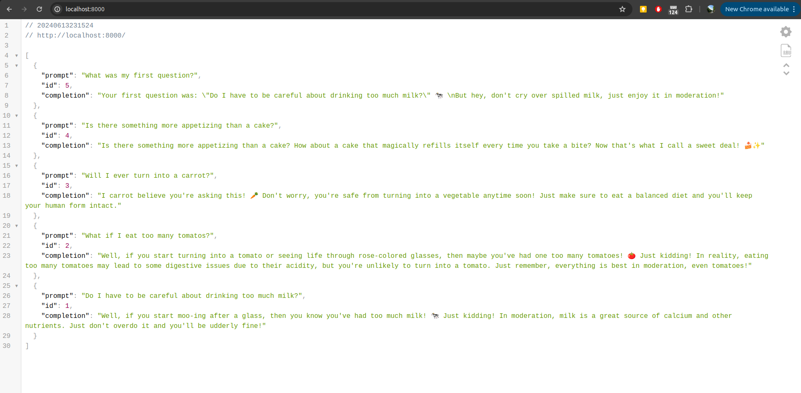
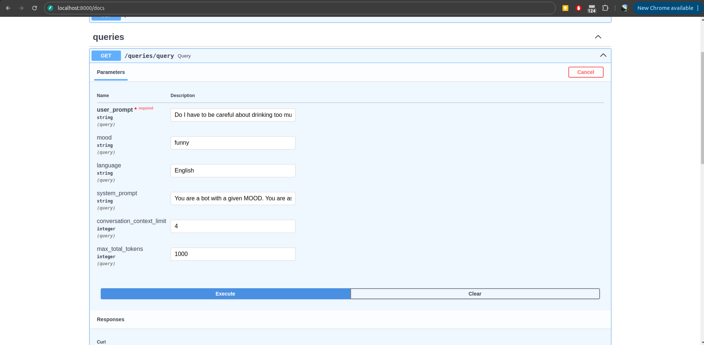
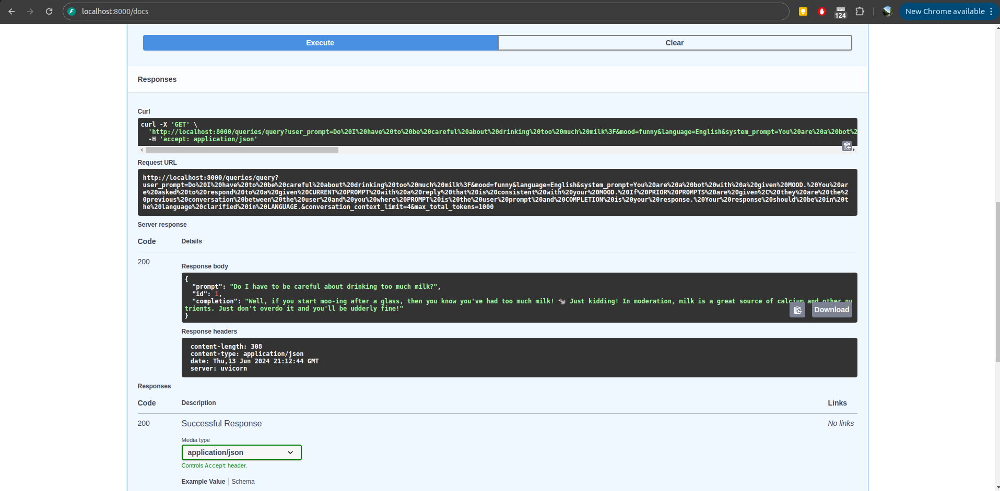

# OpenAI Mood-Responsive Chatbot

This is a ChatBot application which users can use to ask questions and set the mood of the response they desire as well as the language the response should be in. 
It is written in Python with a FastAPI backend and using the OpenAI-API to generate responses. 

The application is launched using `python app/main.py` and can be accessed via `localhost:8000` to view past conversations and `localhost:8000/docs` to call the endpoints.


## Installation

### Prerequisites

- Python 3.11 (or other if compatible)

### Setup

1. Clone the repository to your local machine.

2. Navigate to the project directory.

   ```sh
   cd path/to/your/project
   ```

3. Create a virtual environment.

   ```sh
   conda create -n construktiv_chatbot python=3.11
   ```

4. Activate the virtual environment.

     ```sh
     conda activate construktiv_chatbot
     ```

5. Install the required packages.

   ```sh
   pip install -r requirements.txt
   ```

6. Ensure the project directory is added to the Python path.

   - On Linux/Mac:

     ```sh
     export PYTHONPATH=$(pwd)
     ```

   - On Windows (Not tested):

     ```sh
     set PYTHONPATH=%cd%
     ```
7. Add the OPENAI KEY to the .env file.

   ```
   OPENAI_API_KEY="ADD API KEY HERE"
   ```
   
## Running the Application

1. Start the application.

   ```sh
   python app/main.py
   ```

2. Access the application in your web browser at `localhost:8000`.

4. To call API endpoints, navigate to `localhost:8000/docs`.

## Troubleshooting

If you encounter issues with packages not being found, ensure that your Python environment is correctly set up and that the project directory has been added to the Python path as described in the setup instructions.


## Demonstration

Overview of past conversations at `localhost:8000/`.


The application knows the context of past prompts and can interact with them as seen in prompt 5.


Interacting with the API endpoint of the ChatBot at  `localhost:8000/docs`. 

The ChatBot can reply to inquiries set by the user. The user can choose in which kind of mood the ChatBot should reply in as well as the language.
On demand the type of reply expected from the ChatBot can be overwritten. Additionally a maximum amount of tokens a query can use can be set. 






